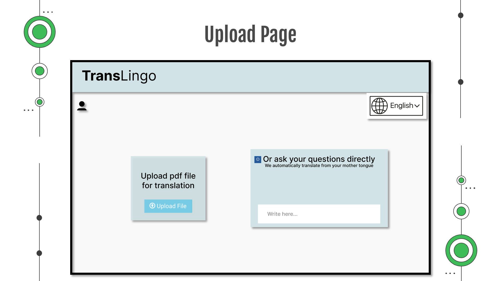

# TransLingo - Effiziente Dokumentenübersetzung mit Text-to-Speech für Behörden

**TransLingo** bietet eine sichere und effiziente Lösung zur Übersetzung und Sprachsynthese von Dokumenten für deutsche Behörden. Die Anwendung verbindet eine hybride Cloud-Architektur zur Wahrung der Datensicherheit und Flexibilität.

---

## Projektübersicht

### Ausgangssituation

Eine deutsche Behörde setzt derzeit auf veraltete On-Premise-Systeme, die kostenintensiv und wartungsaufwendig sind. Um die Effizienz zu steigern, wird eine Cloud-basierte Lösung für Dokumentenübersetzung und Text-to-Speech benötigt. Ziel ist die Entwicklung eines **Proof of Concept (PoC)** unter Verwendung von **AWS Translate** und **AWS Polly**.

---

## Anforderungen und Implementierung

### Projektanforderungen
1. **Effizienz**: Skalierbare Cloud-Lösungen für TTS und Übersetzung.
2. **Sicherheit**: TLS/SSL für sichere Datenübertragung, VPN für Onsite-Cloud-Kommunikation.
3. **Kosten**: Reduzierte On-Premise-Kosten durch gezielte Nutzung von Cloud-Ressourcen.
4. **Datenmanagement**: Onsite-Speicherung persönlicher Daten, effiziente Nutzung von AWS-Services für Anfragen ohne sensitive Daten.

### Industriestandards und Technische Details
- **Datenübertragung**: TLS/SSL, gRPC und Protocol Buffers für optimierten und sicheren Datenaustausch.
- **Serverless-Architektur**: Einsatz von AWS Lambda und AWS S3 zur dynamischen Skalierung und einfachen Integration von TTS- und Übersetzungsprozessen.
- **Weitere AWS-Services**: Nutzung von CloudWatch zur Überwachung und Protokollierung der Prozesse.

### Lösungsvorschlag: Hybrid-Cloud-Ansatz
- **Cloud-Szenario**: Persönliche Daten werden Onsite gespeichert; rechenintensive Prozesse wie Text-to-Speech laufen in der AWS-Cloud.
- **Sicherheit**: Verschlüsselte Übertragung und Speicherung sensibler Daten, Verwendung von Industriestandards (z. B. TLS/SSL).
- **Skalierbarkeit**: Nutzung von AWS-Services für dynamische Skalierung bei erhöhten Anfragen.
- **Kostenoptimierung**: Pay-per-Use-Modell und flexible Ressourcennutzung in der Cloud.

---

## Projektaufbau und Proof of Concept (PoC)

### Schritte zur Implementierung
1. **AWS-Anmeldung**: Zugang zum vorkonfigurierten AWS-Konto mit benötigten Berechtigungen.
2. **Infrastrukturaufbau**: Erstellen der benötigten Infrastruktur über AWS-Konsole oder Infrastructure as Code (IaC).
3. **Implementierung der Applikationslogik**: Nutzung von AWS SDK oder API zur Integration von AWS Translate und Polly.
4. **Test und Validierung**: Manuelles Hoch- und Herunterladen von Dateien zur Funktionsprüfung.

### Demo-Funktionen
- **Login Page**: Authentifizierter Zugang zur Anwendung.
- **Upload Page**: Sicherer Upload und Verarbeitung von Dokumenten.

---

## Feedback und Verbesserung

Wir freuen uns über Feedback zur Nutzung und Performance der Lösung. Für Fragen oder Anmerkungen kontaktieren Sie uns gerne!

**DANKE!**
